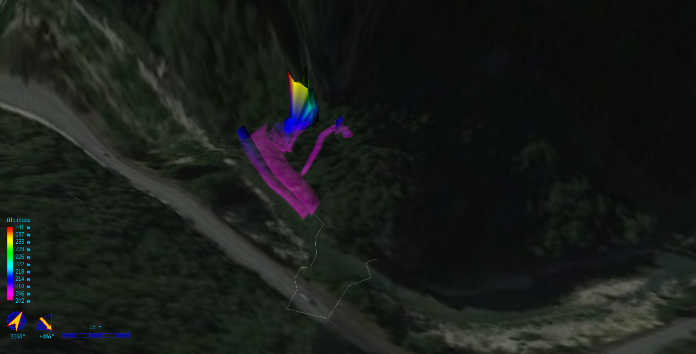

73MAAN - Buco del Bagno
=======================

Requirements
------------

* Therion + Loch

Build
-----

on Windows you can just double click on build.bat,

on other platforms

/path/to/therion buco-del-bagno.thconfig

after the build following files will appear:
* `Buco del bagno - plan.pdf` The plan of the cave
* `Buco del bagno.lox` The 3D model of the cave

Elevation Data
--------------

Elevation data has been built by the [Terrain Tool](http://www.ubss.org.uk/terraintool/terraintool.php) with theese settings

	Grid reference: 33T  334540 4807137
	E-W Range (m): 800,00
	N-S Range (m): 800,00
	Spacing (m): 5,00
	Grid Ref is at: SW

	Coordinate System: UTM
	Datum: WGS-84
	Ellipsoid: GRS80

	Terion cs name: UTM33

Due to missing/wrong elevation data in the gorge zone, the generated therion file has been patched replacing values `-32768.00` with `200`
